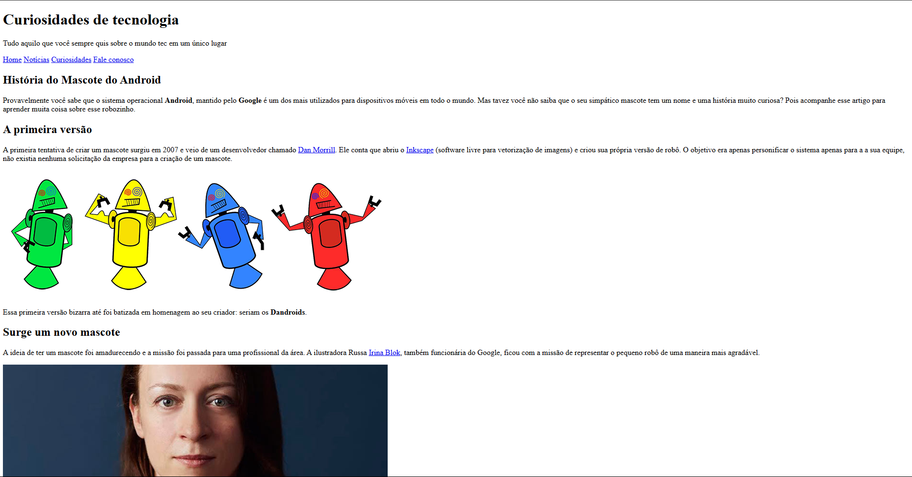

# Meu Primeiro Website

Este repositório contém o meu **primeiro website**, desenvolvido durante o curso do [Curso em Vídeo](https://www.cursoemvideo.com/). É um projeto simples, criado com **HTML** e **CSS**, mas que tem um enorme significado para mim. Foi o marco inicial da minha jornada na programação e, na época, eu achei fantástico — me sentia um super programador! 😄 **Bons tempos!**

---

## Tecnologias Utilizadas

- **HTML5**
- **CSS3**

---

## Objetivo do Projeto

- Explorar os fundamentos do desenvolvimento web.
- Criar e estilizar uma página simples utilizando apenas HTML e CSS.
- Marcar o início da minha jornada no mundo da programação.

---

## Pré-visualização

  

---

📚 *Projeto desenvolvido com muito entusiasmo e carinho durante o Curso em Vídeo.*
